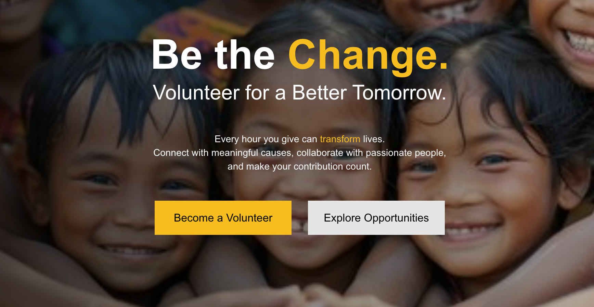

# Volunteer Registration System

This is a full stack Application to allow volunteers to register themselves with nayePankh foundation , along with admin panel to allow admin to manage Volunteers and Events.
  

### Main Features : 
- Volunteers are able to register them using a simple form on volunteer Panel.
- Admin can approve, reject and manage the Volunteer application.
- Admin can Post new and upcoming Events and manage these events from same admin panel.
- Full Stack application with Database integration and best coding practices.
- Follows a scalable , modular and resuable architecture .

### Links:

- Admin Panel : https://naye-pankh-foundation-volunteer-reg-olive.vercel.app/
- Volunteer Panel : https://naye-pankh-foundation-volunteer-reg-two.vercel.app/

### Tech Stack:
- Admin Panel : NextJs with typescript
- Volunteer Panel : NextJs with typescript
- Backend Server : Express and Node
- Database : MongoDB (no-sql)
- ODM : Mongooose
- API : RESTful APIs

### Connect with me :  

- Linkedin : https://www.linkedin.com/in/vivek-patel2004/
- Leetcode : https://leetcode.com/u/vivek-patel-here/
- Github : https://github.com/vivek-patel-here

